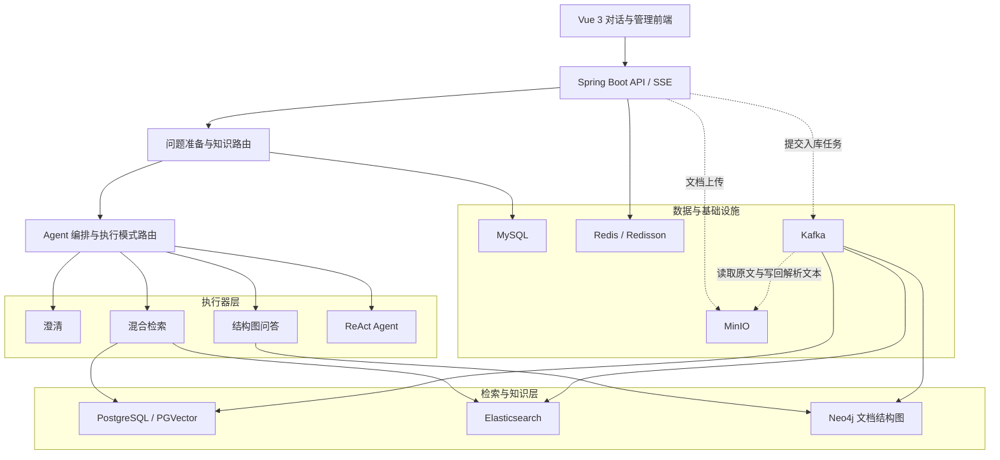
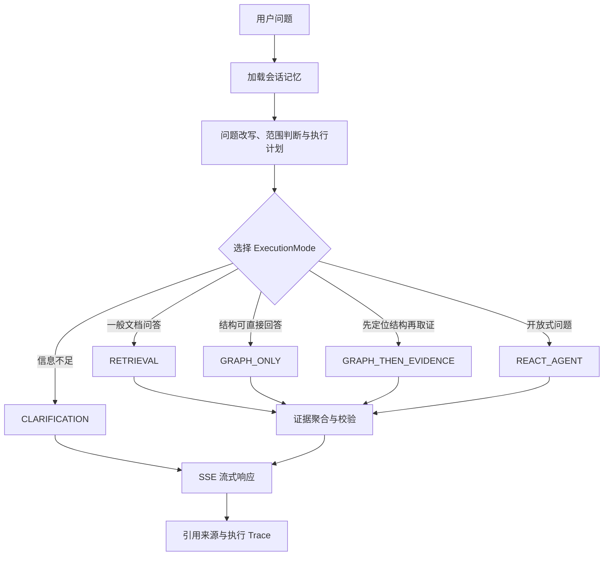

# GenBox-Agent

     

     

> 面向企业知识场景的可观测 RAG Agent 平台

GenBox-Agent 基于 Java 17、Spring Boot 3.5 与 Spring AI 1.1 构建。项目没有把所有问题直接交给大模型，而是通过问题准备、知识路由、执行模式编排、混合检索、结构图问答和证据校验，将企业文档问答拆解为可控制、可观测、可演进的工程链路。

## 网站链接
[点击打开GenBox‑Agent演示页面](https://com.gen-box.xyz)

## 项目概况

传统 RAG Demo 通常采用“问题 → 向量检索 → 大模型生成”的单一路径。在企业知识场景中，这种做法容易遇到意图不明确、关键词召回不足、文档层级丢失、回答缺少依据和执行过程难排查等问题。

GenBox-Agent 在检索前完成问题改写、范围判断与执行计划生成，在回答前完成证据聚合与有效性校验，并通过专用执行器分别处理澄清、混合检索、结构图直答、结构定位后取证和开放式工具调用。

## 核心亮点

- **确定性 Agent 编排**：五种活跃执行模式对应不同问题类型，避免所有请求都进入不可控的统一 Agent 循环。
- **混合检索与融合排序**：组合 PGVector 语义召回、Elasticsearch 关键词召回、RRF 融合和可选 Rerank。
- **证据驱动生成**：通过 Parent-Child 聚合、证据预算、证据校验和无证据短路控制回答依据。
- **文档结构图谱**：保存章节、层级和步骤关系，为明确位置与结构类问题提供独立处理路径。
- **知识路由与文档治理**：按 Scope、Topic、Document 收缩检索范围，通过异步入库链路维护多种索引。
- **工程化治理**：提供会话记忆、Redis 租约、调用限制、重试降级、执行 Trace 和运营管理页面。

## 系统架构



架构分为交互层、Agent 编排层、执行器层、知识检索层和基础设施层。对话请求只访问当前执行模式所需的组件；文档入库则通过对象存储和异步任务更新业务数据、向量索引、关键词索引与结构图谱。

## Agent 执行流程



`RAG_CHAT` 仅用于兼容历史数据、历史配置或旧路由结果，不属于当前五种活跃执行路径。

## 技术亮点详解

### 1. 确定性 Agent 编排

请求首先经过会话记忆加载、问题改写、范围判断和执行计划生成，再由编排器选择 `CLARIFICATION`、`RETRIEVAL`、`GRAPH_ONLY`、`GRAPH_THEN_EVIDENCE` 或 `REACT_AGENT`。每种模式由专用执行器承担，路由判断与具体执行彼此分离。

这种设计牺牲了单一 Agent 循环的实现简洁度，换来更明确的输入条件、失败边界、测试入口和 Trace 阶段，适合需要稳定性和可审计性的企业知识场景。

### 2. 混合检索与融合排序

PGVector 负责语义相似召回，Elasticsearch 负责关键词和专有名词匹配。来自不同检索源的结果经过标准化、去重与 RRF 融合，再按配置选择是否调用外部 Rerank 调整最终排序。

双通道能够弥补单一向量召回对精确词项不敏感的问题，但也增加了索引一致性、融合参数和故障降级的维护成本。

### 3. 证据驱动的回答生成

检索以细粒度 Child 块获得更准确的召回，再向上聚合 Parent 块恢复完整上下文。生成前会执行证据预算和有效性校验；缺少可用依据时走无证据短路，而不是强制模型补全答案。

回答可以携带引用来源，并把证据选择过程写入 Trace。这提高了可解释性，但会让部分信息不足的问题选择澄清或保守拒答。

### 4. 文档结构图谱与多阶段入库

上传文件先进入 MinIO，对象信息与任务状态进入业务库；Kafka 驱动后续异步处理，Apache Tika 完成文档解析，再生成切块、向量索引、关键词索引和章节结构数据。

Neo4j 保存文档章节、层级和步骤关系，使“某一节包含什么”“第几步是什么”等结构问题不必完全依赖文本相似度。多阶段入库提高了能力上限，也要求任务具备可重试和状态可观测性。

### 5. 三级知识路由与会话记忆

知识路由按照 Scope、Topic、Document 逐级缩小候选范围，并持久化路由决策与影子评估信息，便于分析选择结果。它减少了默认全库检索带来的噪声，但需要额外维护路由索引和阈值。

会话侧支持最近消息窗口与长期摘要组合，避免上下文随轮次无限增长。摘要压缩节省 Token，同时也需要在压缩率与关键信息保真之间取舍。

### 6. 可观测与分布式治理

一次对话会记录路由、检索、模型、工具、推荐问题和最终生成等阶段信息。模型调用、工具调用和检索证据可关联到同一会话与交换标识，便于定位慢点、失败点和证据来源。

多实例环境通过 Redis 租约处理会话执行互斥与续租，并通过调用上限、重试和降级避免工具或外部服务异常无限放大。该方案依赖 Redis 可用性，因此租期、续租和异常释放策略需要谨慎配置。

## 技术难点与设计取舍

| 问题 | 简化方案 | 项目选择 | 主要收益与成本 |
| --- | --- | --- | --- |
| 检索召回 | 单路向量检索 | PGVector + Elasticsearch + RRF + 可选 Rerank | 同时覆盖语义与关键词信号；代价是索引与融合链路更复杂 |
| 回答可信度 | 检索后直接生成 | 证据预算、校验、引用与无证据短路 | 降低无依据生成；代价是部分问题会保守拒答 |
| 检索范围 | 默认搜索全库 | Scope → Topic → Document 路由 | 缩小候选空间并提高可解释性；需要维护路由索引 |
| Agent 执行 | 所有请求进入统一 Agent | 确定性模式路由与专用执行器 | 更可控、可测试、易排查；需要维护多条执行路径 |
| 并发治理 | 进程内锁 | Redis 租约与续租 | 支持多实例互斥和异常恢复；依赖 Redis 可用性与租约参数 |

## 技术栈与代码结构

| 层次 | 技术与组件 |
| --- | --- |
| Agent 与后端 | Java 17、Spring Boot 3.5.6、Spring AI 1.1.0、Spring AI Alibaba |
| 数据访问 | MyBatis-Plus、MySQL、PostgreSQL / PGVector |
| 检索与图谱 | Elasticsearch、RRF、可选 Rerank、Neo4j |
| 文档与消息 | Apache Tika、MinIO、Kafka |
| 分布式治理 | Redis、Redisson、租约、锁、重复执行限制、延迟队列 |
| 前端与测试 | Vue 3、Vite、Tailwind CSS、Vitest、Playwright |

```text
GenBox-Agent/
├── genbox-agent-chat/
│   └── genbox-agent-business-chat/   # 对话、Agent、RAG、文档治理与管理 API
├── genbox-agent-common/              # 通用基础与 Web 能力
├── genbox-agent-id-generator-framework/
├── genbox-agent-redis-tool-framework/
├── genbox-agent-redisson-framework/  # 锁、租约、重复执行限制与延迟队列
├── sql/                              # MySQL 与 PostgreSQL/PGVector 初始化脚本
└── vue/                              # Vue 3 对话与运营管理前端
```

> 当前快照聚焦生产核心，未包含独立学习示例模块。本文仅介绍根 POM 已聚合且工作区实际存在的生产模块。

## 快速运行

### 环境要求

- JDK 17、Maven 3.9+
- Node.js 20+、npm
- MySQL 8、PostgreSQL 与 PGVector 扩展
- Redis、Kafka、MinIO、Elasticsearch、Neo4j
- OpenAI 兼容模型服务；联网搜索能力需要相应搜索服务配置

账号、密钥、模型地址和中间件凭据应通过环境变量或本地配置覆盖，不要把真实凭据提交到仓库。

### 初始化数据库

```bash
mysql -u root -p < sql/Mysql/create_database_mysql.sql
mysql -u root -p < sql/Mysql/create_table_mysql.sql

psql -U postgres -f sql/PostgresSql/create_database_postgres_sql.sql
psql -U postgres -d genbox_agent_pgvector -f sql/PostgresSql/create_table_postgres_sql.sql
```

MySQL 脚本创建并使用 `genbox_agent`，PostgreSQL 脚本使用 `genbox_agent_pgvector`；执行 PostgreSQL 建表脚本前需先安装并启用 PGVector 扩展。

### 启动后端

```bash
mvn -pl genbox-agent-chat/genbox-agent-business-chat -am clean install -DskipTests
mvn -f genbox-agent-chat/genbox-agent-business-chat/pom.xml spring-boot:run
```

后端入口为 `com.genbox.ai.GenBoxAgentBusinessChatApplication`，默认监听 `http://127.0.0.1:9082`。

### 启动前端

```bash
cd vue
npm ci
npm run dev
```

前端默认监听 `http://127.0.0.1:5173`，开发服务器将 `/api`、`/admin/auth` 和 `/manage` 代理到后端；后端地址不同时可通过 `VITE_PROXY_TARGET` 覆盖。

常用校验命令：

```bash
npm run test:unit
npm run test:e2e
npm run build
```

## 可深入讨论的技术点

- 如何设计 RRF 权重、Rerank 接入和跨检索源去重？
- 什么类型的问题更适合结构图问答，而不是向量检索？
- Parent-Child 切块如何平衡召回粒度与上下文完整性？
- 无证据短路如何在可信度与回答覆盖率之间取舍？
- 会话摘要压缩如何避免上下文无限增长和关键信息丢失？
- Redis 租约如何处理续租、超时、进程崩溃和重复执行？
- Trace 如何串联路由、检索、模型调用、工具调用和最终生成？
